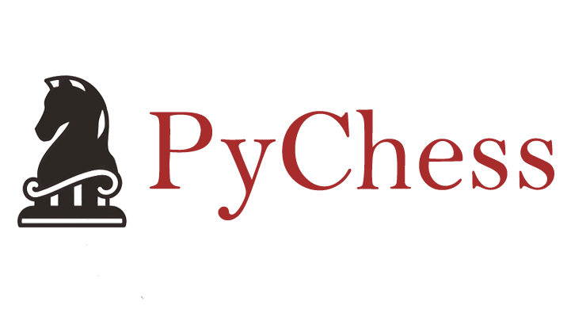
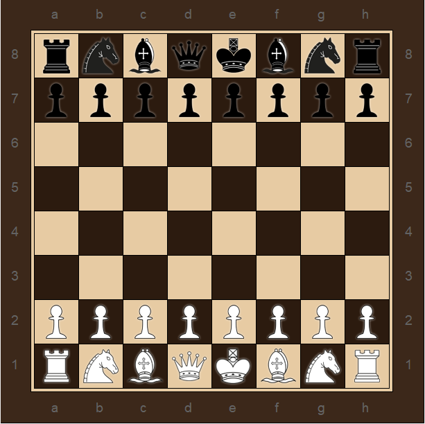

<p align="center">
  
</p>

PyChess is a pure Python chess library with move generation and move validation.
PyChess uses a bitboard representation for its internal calculations.

<p align="center">
  
</p>


## Requirements

* Python3.x
* numpy

## Installation
```
$ python setup.py install
```

## Features

### movement suggestion


## License

Source codes in the repository follows [MIT](http://www.opensource.org/licenses/MIT) license.
