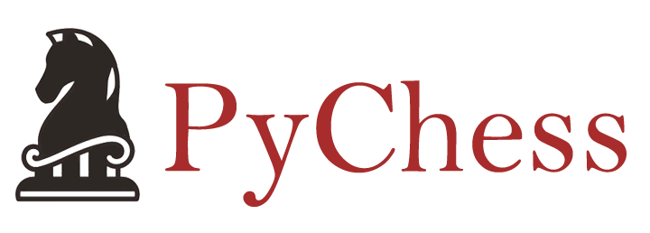

<p align="center">
  
</p>

PyChess is a pure Python chess library with move generation and move validation.
PyChess uses a bitboard representation for its internal calculations.

### overview

| Component | Description |
| ---- | --- |
| **pychess** | a chess library |
| **pychess.chess** | the main chess class with bitboard representation dealing the all calculations |
| **pychess.gui** | draws beautiful GUI using only tkinter for pychess |
| **pychess.img** | images used for GUI are in here |

## Requirements

* Python3.x
* numpy

## Installation
```
$ python setup.py install
```

## Features

### appearance

```
$ cd pychess
$ python gui.py
```

<p align="center">
  
</p>

### movement suggestion

shows available movements for a selected piece

<p align="center">
  
</p>

## License

Source codes in the repository follows [MIT](http://www.opensource.org/licenses/MIT) license.
